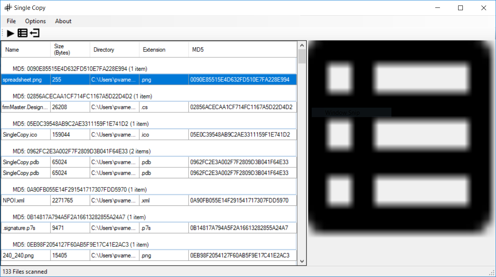

## Overview
Tool to assist in scanning a file system to identify potential duplicate files and provide the ability custom additonal actions or automation.

## Features
- File Preview for Images
- File Preview for Text documents
- Delete a file by selecting it and pressing delete 
  - To disable the are you sure prompt you can find a setting in Options
- Additional file properties are available in Options
- You can export the visible columns to an Excel formatted document

